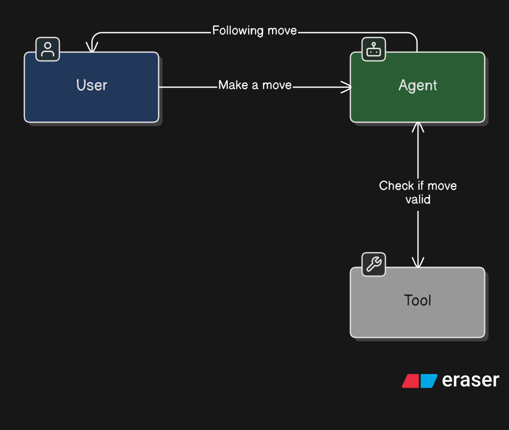

# Chess Playing Agent

This is work in progress attempt to build a **chess-playing agent**.
Essentially, once the player has made a move, the agent should respond given its color and the history of moves.
The agent should generate some commentary(*a-la* [chess.com](chess.com) bots) and the next move given the currently played moves.

The project relies on [langchain](https://www.langchain.com/langchain) to coordinate the agent and tool calls, and is meant for my own educational purposes.

Currently the structure is intended to be something like this:

